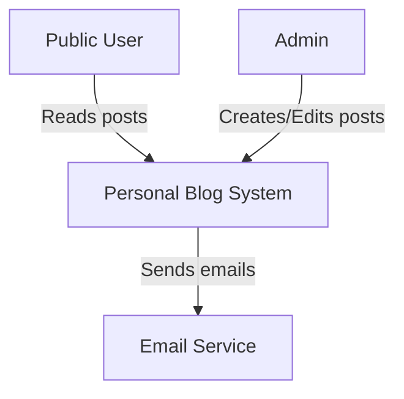
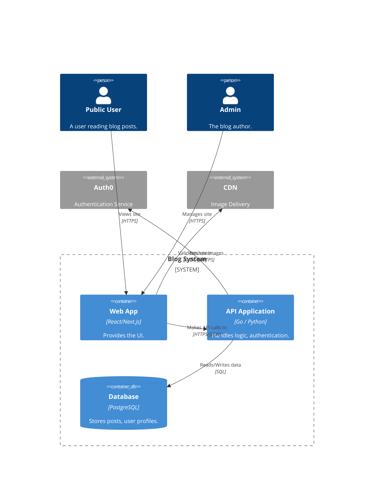

I can certainly teach you the process of creating architecture diagrams! Here is a guide and answers to your important questions.

### The Importance of Architecture Diagrams (Especially for Beginners)

As someone with no job experience, creating and showcasing architecture diagrams is **extremely important**. It's one of the best ways to bridge the "no experience" gap on your resume.

Here’s why:

1. **Proof of Competence:** A well-crafted diagram proves you understand how multiple components (servers, databases, load balancers, security) work together. You're not just writing code in isolation; you're building systems.
2. **Portfolio Killer Feature:** While anyone can clone a simple web app, showing the diagram for that app—or even a hypothetical, complex one—marks you as a professional. It's an excellent talking point during interviews.
3. **Communication and Collaboration:** In a real job, you rarely build alone. Diagrams are the language you use to communicate designs to other developers, security teams, and stakeholders.
4. **Faster Learning:** For your own projects, diagramming *before* you code helps you visualize bottlenecks, single points of failure, and security risks. It prevents costly re-coding later.

**Do you need "a lot of knowledge"?** No, not to start. You need basic knowledge of what common components do. For instance, to create a simple web app diagram, you just need to know:

* A user (Client)
* A web browser (front-end)
* An application server (back-end)
* A database (where data is stored)

As your knowledge grows (adding things like Caching, CDNs, Load Balancers, IAM security), your diagrams will naturally become more complex and complete. The key is to start simple.

**Must they be accurate from the get-go?** Yes and no. They should be accurate for the purpose they serve. For a simple design, it should accurately reflect what you built. However, diagrams are iterative. You'll often sketch a rough version first, identify issues, and then make a final, accurate version. In a job, you will often create "Future State" diagrams that are aspirations and may change during implementation.

---

### Step-by-Step Guide to Creating Architecture Diagrams

The key is structure. The C4 model is a popular framework for diagramming, and it breaks down systems from a high-level context down to the detailed code components.

Here is a simplified process:

#### **Step 1: Define the Purpose and Scope**

Before you draw a single box, answer these questions:

* **What system am I designing?** (e.g., A blog, an e-commerce backend, a data pipeline.)
* **Who is the audience?** (Business people need a simple flow; engineers need to know about ports and database schemas.)
* **What problem is this design solving?** (Scalability, security, simple deployment.)

#### **Step 2: Identify the Actors (Users and External Systems)**

Who uses this system? Who or what triggers its events?

* *Blog App:* Admin (who writes posts), Public User (who reads posts).
* *External:* Stripe (for payments), Auth0 (for login).

#### **Step 3: Sketch the High-Level Flow (C4 - System Context)**

This is the most important step. Use pen and paper first. Draw your actors on the outside, and a big box for your system in the middle. Show the relationships.

**Blog App Context:**

```
graph TD
    User[Public User] -->|Reads posts| BlogApp[Personal Blog System]
    Admin[Admin] -->|Creates/Edits posts| BlogApp
    BlogApp -->|Sends emails| EmailSvc[Email Service]

```



#### **Step 4: Detail the Core Components (C4 - Containers)**

This is where you break down your system into "containers" (applications, data stores, databases, external services). Ask: *How does my system actually work?*

**Blog App Containers:**



```
C4Container
    Person(p_public, "Public User", "A user reading blog posts.")
    Person(p_admin, "Admin", "The blog author.")
    
    System_Boundary(b, "Blog System") {
        Container(c_frontend, "Web App", "React/Next.js", "Provides the UI.")
        Container(c_backend, "API Application", "Go / Python", "Handles logic, authentication.")
        ContainerDb(db, "Database", "PostgreSQL", "Stores posts, user profiles.")
    }
    
    System_Ext(s_auth, "Auth0", "Authentication Service")
    System_Ext(s_cdn, "CDN", "Image Delivery")

    Rel(p_public, c_frontend, "Views site", "HTTPS")
    Rel(p_admin, c_frontend, "Manages site", "HTTPS")
    
    Rel(c_frontend, c_backend, "Makes API calls to", "HTTPS/JSON")
    Rel(c_backend, db, "Reads/Writes data", "SQL")
    Rel(c_backend, s_auth, "Validates users", "OIDC/JWT")
    Rel(c_frontend, s_cdn, "Fetches images", "HTTPS")
```

#### **Step 5: Define Communication and Interaction**

Now, define *how* the components communicate. Add labels to your connection lines. Are they synchronous (API call), asynchronous (message queue)? What protocols are used (HTTP, MQTT, database driver)?

* Front-end -> Back-end: HTTPS / REST or GraphQL.
* Back-end -> Database: TCP / PostgreSQL Driver.
* Back-end -> Caching Service: TCP / Redis protocol.

#### **Step 6: Iteration and Refinement (Adding Realism)**

Once you have the components and flow, refine it. For your portfolio, you want to show consideration for real-world concerns:

1. **Security:** Where do you need HTTPS? Where are the firewalls? Where do you use an Identity Provider (like Auth0)? (Mark these with icons or boundary lines).
2. **Scalability:** Do you need a Load Balancer in front of your back-end? Do you need a Read Replica for your database?
3. **Performance:** Do you need to add a cache (like Redis) in front of your database for frequently accessed posts?
4. **Resilience:** Where is your single point of failure? (Adding multiple app servers removes that failure point).

#### **Step 7: Pick Your Tool**

While you should always start with a sketch (pen and paper, or a simple digital whiteboard), you should formalize your best work with a specialized tool for your portfolio.

* **Top Recommendations:**
* **Lucidchart / Visio:** The industry standard, but can be expensive. Powerful.
* **Draw.io (now diagrams.net):** Free, very popular, and good enough for 95% of use cases. Integrates with Google Drive/GitHub.
* **Excalidraw / Miro:** Excellent for collaborative whiteboarding and "sketchy" looking diagrams that are perfect for design interviews.
* **PlantUML / Mermaid:** Diagrams-as-Code (like the C4 diagram I generated above). The code is stored as text, which is great for version control in your projects.


### Your Path Forward:

1. **Pick one of your existing simple projects.** (Or create a hypothetical one).
2. **Start sketching.** Focus only on the flow first. What components do you need?
3. **Formalize it.** Use Draw.io or Excalidraw to make a clean digital version.
4. **Add a 1-page design document** explaining your choices (why that database? how is it secured?).
5. **Publish it to GitHub.** This is your new "experience." It tells a recruiter: *"I don't just write code; I design systems."*


---
                         
                         
                         Kubernetes Cluster
                                │
                                │
                         ┌──────▼──────┐
                         │    MySQL    │
                         │  Deployment │
                         │   1 Replica │
                         └──────┬───────┘
                                │
                       ┌────────▼────────┐
                       │  MySQL Container │
                       │     Port 3306    │
                       └────────┬─────────┘
                                │
                     /var/lib/mysql
                                │
                       ┌────────▼────────┐
                       │ PersistentVolume │
                       │      Claim       │
                       │      250Mi        │
                       └────────┬─────────┘
                                │
                       ┌────────▼────────┐
                       │ PersistentVolume │
                       │      250Mi        │
                       └──────────────────┘


        ┌────────────────────────────────────┐
        │              Secrets               │
        │                                    │
        │ mysql-root-pass                    │
        │ mysql-user-pass                    │
        │ mysql-db-url                       │
        └────────────────┬───────────────────┘
                         │
                         ▼
                  MySQL Environment
                    Variables


        Client
          │
          │ NodePort :30007
          ▼
   ┌──────────────┐
   │ MySQL Service│
   │    :3306      │
   └──────────────┘


---


   

---


